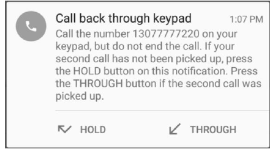

# Monitor: Preventing Caller ID Spoofing
2016 - 2017

### Paper
* Jump to [research paper](subramanian_kailash_PAPER.PDF)

--------

  
   
  <i>Handling an incoming call from organization database (screenshot of app)</i>

--------

### Abstract
Many people around the world are victims of Caller ID spoofing, a type of identity theft in which a spoofer, or the attacker, purposely changes their Caller ID, the number displayed on the phone, to appear as if the call is from a trustworthy caller. In this engineering project, an Android application will be designed and developed to successfully identify a spoofed call and protect the user from this type of identity theft. With the advent of new types of technology like Asterisk or FreeSWITCH, it is easy for anyone to create a fake call to masquerade as a trustworthy caller, for example, from a bank, the government, and entice the user to give away personal information, resulting in identity theft. This project can help save the lives of millions of people around the world who fall to scammers that steal private information. Analyzing features of someone’s voice, such as their pitch, can be used with data mining to categorize the call as spoofed or not spoofed. 

When the user calls someone, the call will not be spoofed, since it is an outgoing call. The application will analyze the voice of the recipient and collect data, using an algorithm, about the pitch (or the frequency of the audio), volume, and tone. When an incoming call is received, the application will make a prediction based on the voice of the caller, and it will compare it with the Caller ID transmitted through the call. If they do not match, the call is spoofed.

First, it is necessary to develop an Android application using Android Studio, and IDE developed by Google. Next, to test the application, 20 phone numbers on pre-recorded calls was stored in the database, along with the corresponding voice data of each call. Create 40 recorded calls, where there are 2 calls from each phone number, and 20 of these calls are spoofed with a different voice type. Record the time taken for the application to determine if it was spoofed or not, and record whether the prediction was correct. Redesign as needed, and repeat the process until the desired accuracy and latency times are achieved. The results of this application will help victims of Caller ID spoofing feel safe once again, and it will defend against threats by spoofers for the world. The results of this application will have future implications in voice recognition software for recognizing mood and types of voices much more accurately. This can even be used in artificial intelligence, such as Siri, to aid humans. In the medical field, it can be used to aid humans psychologically as well, based on the tone of their voice.

#### About
> The Android app code for Monitor, an application that prevents Caller ID spoofing. Presented at Texas A&M Junior Symposium.
